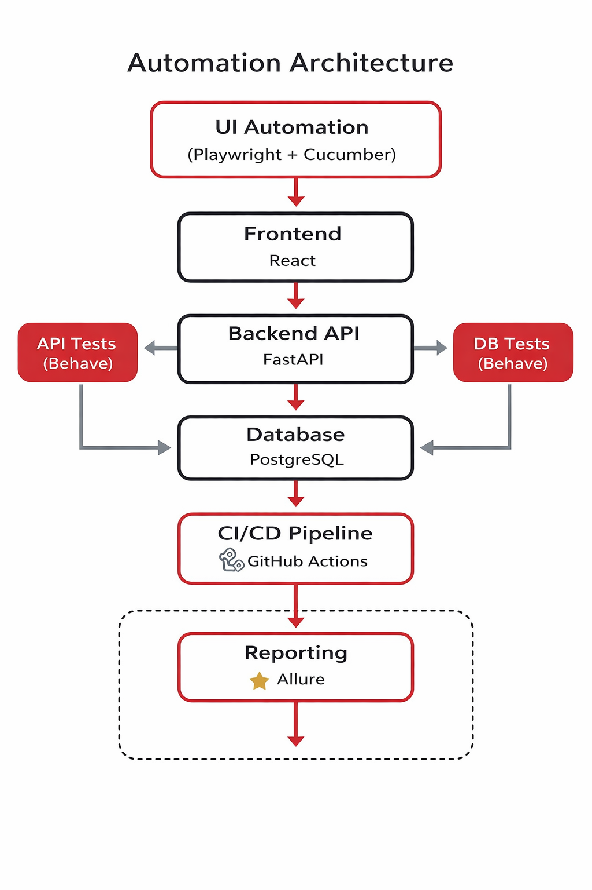

# 🚀 Full Stack Test Automation Framework


---

## 🌐 Live Portfolio

👉 https://kucukkal.github.io/UsedCarDealerProject/

---

## 📌 Overview

This project demonstrates a **production-grade SDET automation framework** validating a full-stack application:

- React Frontend
- FastAPI Backend
- PostgreSQL Database

The framework implements **multi-layer test automation** using BDD principles and CI/CD pipelines.

---

## 🧠 What Makes This Project Stand Out

✅ End-to-end validation across UI + API + DB  
✅ Real CI/CD pipeline with GitHub Actions  
✅ Unified Allure reporting (single dashboard)  
✅ Page Object Model + BDD architecture  
✅ Production-like system design

---

## 🏗️ Automation Architecture




UI BDD Tests (Playwright + Cucumber)
│
▼
React Frontend
│
▼
FastAPI Backend
│
▼
PostgreSQL Database
│
▼
Database Validation Tests


---

## ⚙️ CI/CD Pipeline


Pipeline execution:


Setup Environment
│
▼
API Tests (Behave)
│
▼
UI Tests (Playwright + Cucumber)
│
▼
DB Validation Tests
│
▼
Unified Allure Report


---

## 📊 Allure Reporting


All test results are merged into a **single Allure dashboard** providing:

- Scenario execution results
- Step-level visibility
- Failure diagnostics
- Execution timeline
- Cross-layer traceability

---

## 🖥️ UI Automation Examples

### 🔐 Login Flow


### 📤 Inventory Upload


### ✅ Validation Results


---

## 🧪 Example BDD Scenario


Scenario: Admin uploads inventory Excel file
Given admin logs in
When admin uploads inventory Excel file
Then cars should be added to inventory
And cars should exist in the database


---

## 🛠️ Tech Stack

- Playwright (UI Automation)
- Cucumber BDD
- Python Behave (API Testing)
- PostgreSQL (DB Validation)
- FastAPI (Backend)
- GitHub Actions (CI/CD)
- Allure (Reporting)

---

# ⚙️ Local Setup & Execution

---

## 1️⃣ Clone Repository

```
git clone https://github.com/kucukkal/UsedCarDealerProject.git
cd UsedCarDealerProject
```
2️⃣ Backend Setup (FastAPI)
```
cd app/backend
python3 -m venv venv
source venv/bin/activate
pip install -r requirements.txt
```
▶️ Run Backend
```
uvicorn app.main:app --reload --port 8000
```
3️⃣ Database Setup (PostgreSQL)

Make sure PostgreSQL is running.

Create database:
```
CREATE DATABASE used_car_db;
```
Update .env:
```
POSTGRES_USER=postgres
POSTGRES_PASSWORD=postgres
POSTGRES_DB=used_car_db
POSTGRES_HOST=localhost
POSTGRES_PORT=5432
```
Seed Admin User
```
curl -X POST http://localhost:8000/auth/seed-admin
```
4️⃣ Frontend Setup (React)
```
cd app/frontend
npm install
npm run dev
```
App runs at:

http://localhost:5173
5️⃣ API Tests (Behave)
```
cd test/API
pip install -r requirements.txt
behave --tags ~@skip \
  -f allure_behave.formatter:AllureFormatter \
  -o ../reports/allure_results/api
```
6️⃣ UI Tests (Playwright + Cucumber)
```
cd test/UI
npm install
npx playwright install
```
Run tests:
```
npx cucumber-js --format allure-cucumberjs/reporter
```
7️⃣ DB Tests
```
cd test/DB
behave -f allure_behave.formatter:AllureFormatter \
  -o ../reports/allure_results/db
```
📊 Generate Allure Report (Merged)
```
mkdir -p test/reports/allure_results/merged

cp -R test/reports/allure_results/api/* test/reports/allure_results/merged/ 2>/dev/null || true
cp -R test/reports/allure_results/db/* test/reports/allure_results/merged/ 2>/dev/null || true
cp -R test/UI/allure-results/* test/reports/allure_results/merged/ 2>/dev/null || true

allure generate test/reports/allure_results/merged --clean -o test/reports/allure_report
allure open test/reports/allure_report
```
🔥 One Command (All-in-One)
```
mkdir -p test/reports/allure_results/merged && \
cp -R test/reports/allure_results/api/* test/reports/allure_results/merged/ 2>/dev/null || true && \
cp -R test/reports/allure_results/db/* test/reports/allure_results/merged/ 2>/dev/null || true && \
cp -R test/UI/allure-results/* test/reports/allure_results/merged/ 2>/dev/null || true && \
allure generate test/reports/allure_results/merged --clean -o test/reports/allure_report && \
allure open test/reports/allure_report
```
👨‍💻 Author

Built as a full-stack SDET portfolio project demonstrating real-world automation architecture, CI/CD integration, and scalable testing practices.